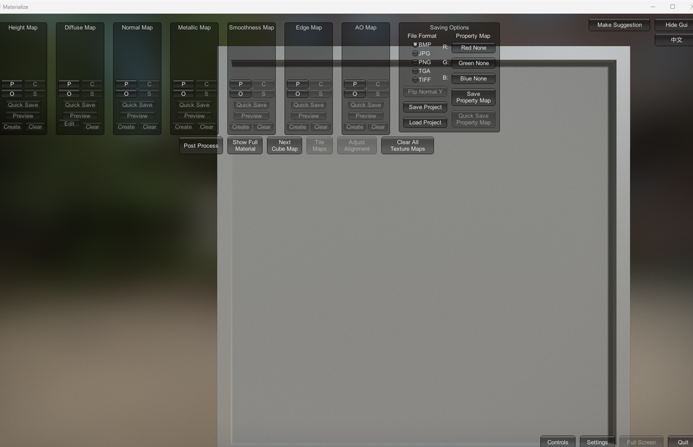

# Materialize 汉化补丁 · 简体中文

**Materialize 1.78 简体中文汉化** —— **不修改原程序任何文件**，卸载即完全还原。

[](LICENSE)
[]()
[]()
[](https://space.bilibili.com/177308205)

> **Materialize** 是 Bounding Box Software 出品的贴图制作工具，把一张照片转成
> 法线 / 高度 / 金属度 / 光滑度 / AO / 边缘等 PBR 材质贴图。
> 本仓库是它的**简体中文汉化补丁**，由 **星空汉化** 制作。

---

## 效果

| 汉化前 | 汉化后 |
|---|---|
|  |  |

---

## 特性

- **一个字节都不改原程序** —— 只新增文件，`Materialize.exe` / `UnityPlayer.dll` /
  `Assembly-CSharp.dll` 的哈希与官方原版完全一致（已逐项校验）
- **中英随时切换** —— 程序里「隐藏界面」下方多了一个按钮，托盘图标左键也能切，还支持热键 <kbd>Ctrl</kbd>+<kbd>Alt</kbd>+<kbd>Z</kbd>
- **词条热重载** —— 改完 `dict.tsv` 保存即生效，不用重启
- **卸载干净** —— 运行 `卸载.bat`，界面立刻恢复英文
- **288 条翻译，全手工校对** —— 3D / 图形学术语按统一术语表处理，不是机翻直出
- 汉化只影响**界面显示**：不改变程序逻辑，也不会写坏工程文件

---

## 快速开始

1. **下载本仓库**（或 `git clone`）
2. 双击 **`安装.bat`**
   它会自动找到 `game\` 目录，把汉化文件装进去
3. 进 `game\` 目录，双击 **`Materialize.exe`**

装完直接启动就是中文，**不需要额外的启动器**。

> 如果 Materialize 装在别的地方（比如你自己从官网下的那份），把目录当参数传进去即可：
> ```
> 安装.bat "D:\Games\Materialize_1.78"
> ```

### 中英切换

三种方式，任选：

| 方式 | 操作 |
|---|---|
| 程序内按钮 | 点右上角「隐藏界面」**下方**的那个按钮 |
| 托盘图标 | **左键**点一下切换；**右键**出菜单 |
| 热键 | <kbd>Ctrl</kbd> + <kbd>Alt</kbd> + <kbd>Z</kbd> |

热键和托盘图标都可以在 `_hanhua\hook.ini` 里改或关掉。

### 卸载

双击 **`卸载.bat`**，界面立刻恢复英文。

---

## 常见问题

**Q：为什么装了之后窗口标题变成了「Materialize - 星空汉化版」？**
A：这是识别补丁是否生效的标志之一。切到英文时标题会自动变回 `Materialize`。

**Q：`BMP` `JPG` `PNG` `TGA` `TIFF`、`R:` `G:` `B:` 这些为什么不翻译？**
A：格式名和通道标记按行业惯例保留英文，翻成中文反而不好认。

**Q：文件浏览器里的文件夹名（`Desktop`、`Materialize_Data`）还是英文？**
A：那是磁盘上的**真实目录名**，翻译它没有意义，也会和资源管理器对不上。

**Q：杀毒软件报警 / SmartScreen 拦截？**
A：非官方汉化普遍会被启发式规则误报 —— 补丁只影响界面显示，不改动原程序。
不放心的话，可以按下面的「从源码构建」自己编译一份。

**Q：界面没变中文怎么办？**
A：看 `_hanhua\logs\hook.log`，日志末尾会写明卡在哪一步。

**Q：想让界面先回英文排查？**
A：按 <kbd>Ctrl</kbd>+<kbd>Alt</kbd>+<kbd>Z</kbd>，或者把 `_hanhua\hook.ini` 里的 `lang` 改成 `en`。

---

## 自定义翻译

打开 `_hanhua\dict.tsv`，每行 `英文<TAB>中文`，`#` 开头是注释。
支持 `\n` `\r` `\t` `\\` 转义（有些按钮标题本身就是两行的）。

**改完保存即生效**，程序每 2 秒检查一次文件变化，不用重启。

想找漏译的地方：把 `_hanhua\hook.ini` 里的 `log_miss` 设为 `1`，
正常用一遍软件，`_hanhua\logs\miss.log` 里就是所有没翻到的原文。

---

## 从源码构建

需要 Visual Studio（含 C++ 工具链）和 [Detours](https://github.com/microsoft/Detours)。

```bat
cd src
build.bat
```

一键编译出 `winhttp.dll`（汉化组件）。

> ⚠️ `src\` 下的转发表是根据**本机**的系统 DLL 生成的。换一台机器
> （或换 Windows 版本）请先跑 `tools\gen_proxy.py` 重新生成。

---

## 目录结构

```
Materialize-CN/
├─ 安装.bat / 卸载.bat / 安装说明.txt
├─ winhttp.dll            汉化组件（预编译，也可自行构建）
├─ _hanhua/
│   ├─ dict.tsv           词条（288 条）
│   ├─ hook.ini           配置：语言 / 托盘 / 热键 / 日志
│   └─ 说明.md
├─ game/                  原版 Materialize 1.78（GPL-3.0，来自上游）
├─ src/                   汉化组件源码（C++）
├─ tools/                 词条提取 / 生成 / 校验脚本
└─ docs/                  截图
```

---

## 已知取舍

- `BMP / JPG / PNG / TGA / TIFF`、通道标记 `R: G: B:` 保留英文
- 文件浏览器列出的**真实文件夹名**不翻译
- 贴图面板上原来那四个 20×20 的小按钮（`P`/`C`/`O`/`S`）放不下两个汉字，
  已改排成 **2×2**、加宽到 50px，译作 `粘贴 / 复制 / 打开 / 保存`
- 汉化在**显示层**生效，所以词条里如果放了一个同时也是数据键的字符串，界面会跟着变
  —— 本项目的 288 条已逐条核对过，都只用于显示

---

## 鸣谢与许可

- **Materialize** © Bounding Box Software，以 **GPL-3.0** 发布，
  源码：<https://github.com/BoundingBoxSoftware/Materialize>
- `game/` 目录下的原程序按其原始 **GPL-3.0** 许可分发，版权归原作者所有；
  本仓库只是原样附带，**未做任何修改**（可用哈希比对验证）
- 汉化补丁代码同样以 **GPL-3.0** 发布，见 [LICENSE](LICENSE) 与 [NOTICE.md](NOTICE.md)
- 汉化制作：**星空汉化** · <https://space.bilibili.com/177308205>

如果这个补丁帮到了你，欢迎到 B 站点个关注 ⭐

---

<sub>关键词：Materialize 汉化 · Materialize 中文补丁 · Materialize 1.78 简体中文 ·
PBR 材质制作工具汉化 · 法线贴图工具中文 · 星空汉化</sub>
